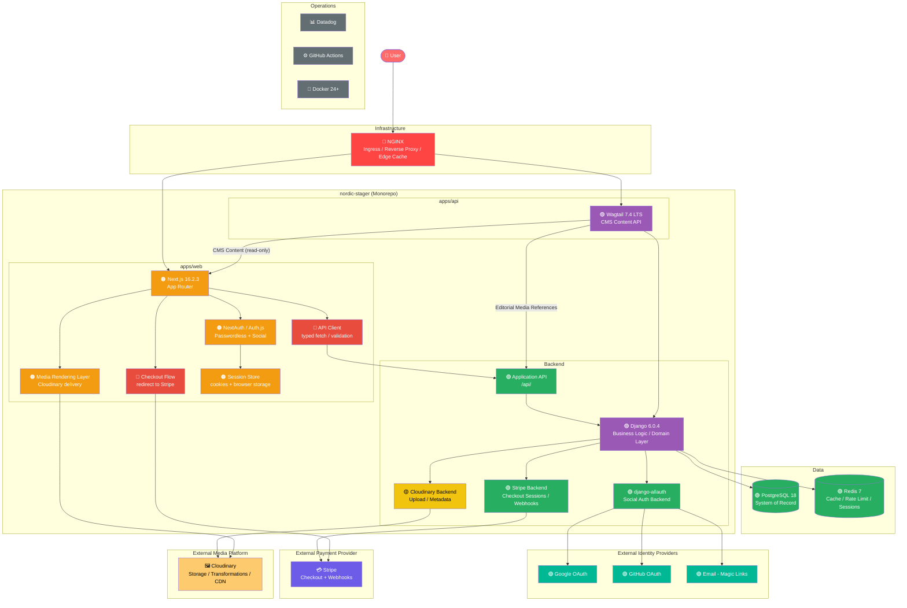

# Nordic Stage

A production-grade event platform with modern fullstack architecture.

---

## Overview

**Current Phase:** Planning and Architecture

This repository focuses on foundational work:
- Architecture design and system contracts
- Milestone planning and issue breakdown
- Infrastructure strategy
- Delivery sequencing

Implementation begins after architecture completion.

---

## Vision

Nordic Stage is a scalable event platform providing:
- Event discovery and browsing
- Agenda and speaker/venue pages
- Secure ticket purchases and payments
- User accounts with saved sessions
- Rich media-driven event presentation
- Editorial content via Wagtail CMS

---

## Architecture


### System Layers

| Component | Role |
|-----------|------|
| **NGINX** | Ingress, reverse proxy, edge caching |
| **Next.js** | Frontend (App Router) |
| **API Client** | Typed fetch and validation layer |
| **Django** | Business logic and domain layer |
| **Application API (/api/)** | Backend contract layer |
| **Wagtail** | CMS content API (read-only to frontend) |
| **Authentication** | NextAuth (frontend) + django-allauth (backend) |
| **Stripe** | Payment processing and webhooks |
| **Cloudinary** | Media storage and delivery |
| **PostgreSQL** | System of record |
| **Redis** | Cache, sessions, rate limiting |
| **Observability** | Datadog monitoring and logging |

### Design Principles

- API-first application design
- Clear CMS/domain/API/frontend separation
- Performance through intelligent caching
- Reproducible local and deployment environments
- Security and observability built-in
- Milestone-driven delivery
- External services for specialized concerns (auth, payments, media)

---

## Technology Stack

| Layer | Technology | Version |
|-------|-----------|---------|
| Frontend | Next.js | 16.2.3 |
| Backend | Django | 6.0.4 |
| CMS | Wagtail | 7.4 LTS |
| API Layer | Django REST Framework | 3.15+ |
| Frontend Auth | NextAuth / Auth.js | 5.x |
| Backend Auth | django-allauth | latest |
| Payments | Stripe | latest |
| Media | Cloudinary | latest |
| Database | PostgreSQL | 18 |
| Cache | Redis | 7 |
| Proxy | NGINX | 1.25+ |
| Runtime | Docker | 24+ |
| CI/CD | GitHub Actions | — |
| Package Managers | Bun, uv | 1.3.12, 0.4+ |

---

## Monorepo Structure

```
nordic-stage/
├── apps/
│   ├── api/
│   │   ├── config/          # Django project config (settings, urls, ASGI)
│   │   ├── accounts/        # User and authentication domain
│   │   ├── events/          # Events, speakers, sessions
│   │   ├── registrations/   # Bookings and saved sessions
│   │   ├── payments/        # Stripe integration and orders
│   │   ├── cms/             # Wagtail CMS models and blocks
│   │   ├── media/           # Cloudinary integration
│   │   ├── core/            # Shared backend utilities
│   │   └── manage.py
│   └── web/
│       ├── app/
│       ├── components/
│       ├── features/
│       ├── lib/
│       └── types/
├── infra/
├── docs/
```

---

## Delivery Tracks

**Infrastructure** · Database, Docker, NGINX, CI/CD, observability  
**Backend** · Django core, domain models, Wagtail, API  
**Frontend** · Next.js architecture, discovery, registration UX  
**Authentication** · Session flow, OAuth, magic links  
**Payments** · Stripe checkout, webhooks, order lifecycle  
**Media** · Cloudinary integration, image/video delivery  

**Total: 18 planned milestones**

---

## Local Development

### Requirements

- Docker 24+
- Node.js 20+
- Bun 1.3.12
- Python 3.13
- uv 0.4+

### Startup

```bash
# Frontend dependencies
bun install

# Backend dependencies
cd apps/api && uv sync && cd ../..

# Infrastructure
docker compose -f infra/docker/docker-compose.yml up -d

# Backend
cd apps/api
uv run python manage.py migrate
uv run python manage.py runserver

# Frontend
cd apps/web && bun run dev
```

**Local Endpoints:**
- Frontend: http://localhost:3000
- Backend: http://localhost:8000
- Wagtail Admin: http://localhost:8000/admin

---

## Security

### Authentication
- Frontend sessions via NextAuth.js
- Backend identity via django-allauth
- OAuth 2.0 (GitHub, Google) + email magic links

### Platform
- NGINX security headers and rate limiting
- Input validation at API boundary
- Typed frontend contract validation
- Environment-based secret management

### Rate Limits
- Public API: 100 req/s per IP
- Registration: 5 req/min per IP
- Admin routes: Protected access

---

## Deployment

### Architecture
- NGINX ingress and edge cache
- Next.js frontend runtime
- Django + Wagtail backend runtime
- PostgreSQL and Redis support
- Docker containerization
- GitHub Actions CI/CD
- Stripe payment processing and webhooks
- Cloudinary media storage and delivery
- Datadog observability

### Environments
- Local development
- Staging
- Production

---

## Contributing

1. Pick an issue from the milestone board
2. Create a feature branch: `feature/{track}-{milestone}-{short-name}`
3. Implement with tests and documentation
4. Pass CI checks and obtain review
5. Merge to main

**Example:** `feature/backend-b2-event-model`

---

## Documentation

- `docs/architecture/` — Design decisions and diagrams
- `docs/api/` — API contracts and OpenAPI docs
- `docs/runbooks/` — Operational procedures

### Milestones

#### Infrastructure

| Milestone | Description |
|-----------|-------------|
| [I1 — Monorepo Setup](docs/milestones/infra/I1-monorepo.md) | Project structure and tooling |
| [I2 — Docker & NGINX](docs/milestones/infra/I2-docker-nginx.md) | Containerization and reverse proxy |
| [I3 — Database & Redis](docs/milestones/infra/I3-database-redis.md) | PostgreSQL and cache layer |
| [I4 — CI/CD & Observability](docs/milestones/infra/I4-ci-cd-observability.md) | GitHub Actions and Datadog |

#### Backend

| Milestone | Description |
|-----------|-------------|
| [B1 — Core Foundation](docs/milestones/backend/B1-core-foundation.md) | Django project setup and base config |
| [B2 — Domain Models](docs/milestones/backend/B2-domain-models.md) | Events, speakers, sessions, venues |
| [B3 — CMS (Wagtail)](docs/milestones/backend/B3-cms-wagtail.md) | Editorial content and page models |
| [B4 — API Layer](docs/milestones/backend/B4-api-layer.md) | REST endpoints and contracts |
| [B5 — Authentication](docs/milestones/backend/B5-authentication.md) | django-allauth and OAuth backends |
| [B6 — Payments (Stripe)](docs/milestones/backend/B6-payments-stripe.md) | Checkout sessions and webhooks |
| [B7 — Media (Cloudinary)](docs/milestones/backend/B7-media-cloudinary.md) | Upload, storage, and metadata |
| [B8 — Performance & Security](docs/milestones/backend/B8-performance-security.md) | Caching, rate limiting, hardening |
| [B9 — Search](docs/milestones/backend/B9-search.md) | Event and content search |

#### Frontend

| Milestone | Description |
|-----------|-------------|
| [F1 — Foundation](docs/milestones/frontend/F1-foundation.md) | Next.js setup and design system |
| [F2 — Public Pages](docs/milestones/frontend/F2-public-pages.md) | Landing, discovery, and static pages |
| [F3 — Event Experience](docs/milestones/frontend/F3-event-experience.md) | Event detail, agenda, speakers |
| [F4 — Registration Flow](docs/milestones/frontend/F4-registration-flow.md) | Booking and checkout UX |
| [F5 — Account Area](docs/milestones/frontend/F5-account-area.md) | User dashboard and saved sessions |
| [F6 — Performance & SEO](docs/milestones/frontend/F6-performance-seo.md) | Core Web Vitals and metadata |
| [F7 — Analytics](docs/milestones/frontend/F7-analytics.md) | Tracking and event instrumentation |

---

## License

MIT — see [LICENSE](LICENSE)